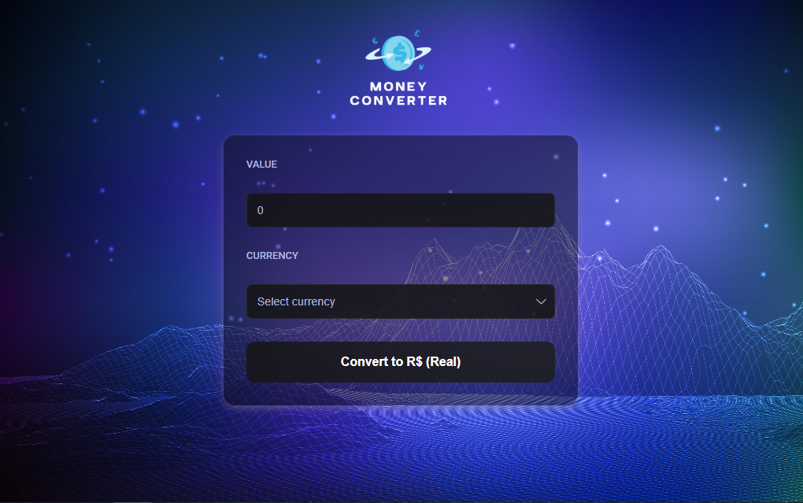
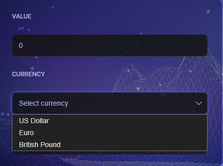

# 💱 Money Converter

Aplicação de conversão de moedas desenvolvida com **HTML, CSS e JavaScript**.  
O objetivo do projeto é praticar conceitos de manipulação do DOM, lógica de programação e consumo de dados (quando houver integração com APIs).

---

## 📸 Preview do Projeto

### 🖥️ Tela inicial


Interface principal onde o usuário informa o **valor** e escolhe a **moeda de origem** para realizar a conversão.

---

### 🌍 Seleção de moedas


Menu suspenso que permite escolher a moeda de origem. Atualmente, estão disponíveis: **US Dollar**, **Euro** e **British Pound**.

---

## 📖 Funcionalidades
- Conversão entre diferentes moedas.  
- Interface simples e responsiva.  
- Atualização dinâmica do valor convertido.  

---

## 🛠️ Tecnologias Utilizadas
- HTML  
- CSS  
- JavaScript  

---

## 🚀 Como Executar
Primeiro, faça o clone deste repositório no seu computador:

```bash
git clone https://github.com/kevinfst/money-converter.git 
```
Em seguida, acesse a pasta do projeto e abra o arquivo **index.html** diretamente no navegador de sua preferência.
